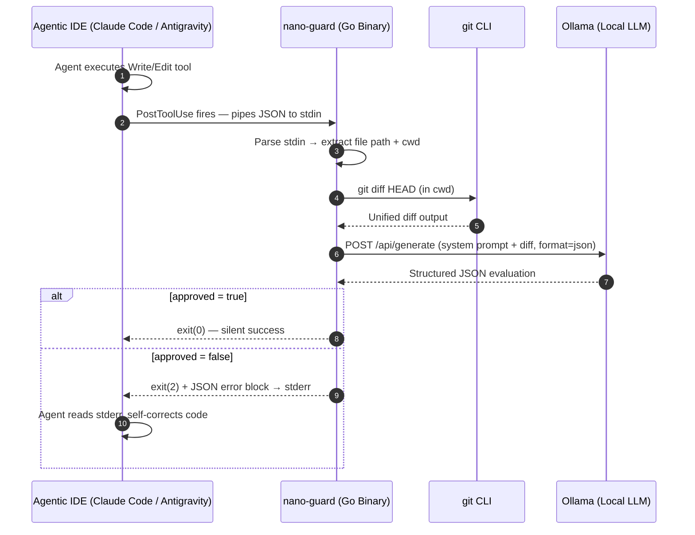

# Nano-Guard: Architecture & System Flow

## 1. High-Level Sequence



---

## 2. Internal Module Flow (Go)

```
main()
  │
  ├── config.Load()              ← reads nano-guard.config.json
  │
  ├── hook.ParseStdin()          ← reads + unmarshals IDE JSON from stdin
  │
  ├── git.ExtractDiff(cwd, file) ← runs git diff, falls back to file read
  │     └─ if diff empty → exit(0) early
  │
  ├── ollama.Evaluate(diff, cfg) ← POST /api/generate
  │     └─ on network error      → exit(0) [fail open]
  │
  └── evaluator.Decide(result)
        ├─ approved = true  → exit(0)
        └─ approved = false → write JSON to stderr → exit(2)
```

---

## 3. Token Budget Design

The core design goal is **minimizing cloud token consumption**:

| Scenario | Cloud Tokens Added | Cost |
|:---|:---|:---|
| Clean edit (approved) | **0** — hook exits silently | $0.00 |
| Rejected edit (1-2 errors) | **~80–150 tokens** (structured JSON error) | ~$0.0001 |
| Hook internal error (Ollama down) | **0** — fail-open, silent exit | $0.00 |
| Large diff (>500 lines) | Diff is **truncated to first 200 lines** before sending to Ollama | $0.00 (local LLM) |

---

## 4. Component Boundaries

```
┌─────────────────────────────────────────────────┐
│                   nano-guard binary              │
│                                                  │
│  ┌──────────┐  ┌──────────┐  ┌────────────────┐ │
│  │  hook/   │  │   git/   │  │    config/     │ │
│  │ (stdin)  │  │  (diff)  │  │  (load JSON)   │ │
│  └────┬─────┘  └────┬─────┘  └───────┬────────┘ │
│       └─────────────┴────────────────┘           │
│                      │                           │
│              ┌────────────────┐                  │
│              │   ollama/      │                  │
│              │ (HTTP client)  │                  │
│              └───────┬────────┘                  │
│                      │                           │
│              ┌────────────────┐                  │
│              │  evaluator/    │                  │
│              │ (exit logic)   │                  │
│              └────────────────┘                  │
└─────────────────────────────────────────────────┘
              ▲                    ▼
         IDE stdin            IDE stderr / exit code
```
