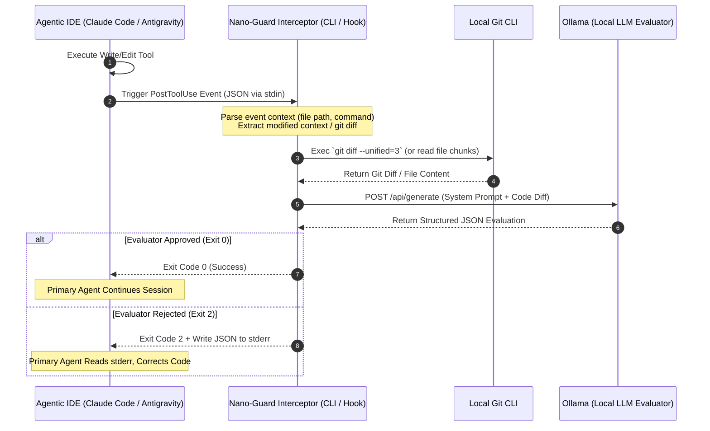

# Nano-Guard: Architecture Specification

Nano-Guard is an autonomous Post-Tool-Use code verification system designed to intercept code write/edit actions in agentic IDEs, evaluate the modifications using a local LLM, and loop back actionable feedback to prevent bad code commits.

---

## 1. System Overview

---

## 2. Core Components

### A. The Interceptor CLI
A lightweight, fast utility written in Go or TypeScript. It is registered within the IDE configuration as a `PostToolUse` lifecycle hook.
* **Input Handling**: Reads structured JSON from the primary IDE agent via `stdin`.
* **Context Extraction**: Identifies the file being modified and retrieves either:
  * The raw `git diff` of the working tree or staging area.
  * The actual modified file chunk if diffing is unavailable.
* **API Client**: Communicates locally with the Ollama server (`http://localhost:11434/api/chat` or `/api/generate`).
* **Output Handling**: Decides the termination outcome:
  * **Exit Code 0**: Everything looks good.
  * **Exit Code 2**: Errors/issues found; writes LLM-generated JSON to `stderr`.

### B. Local LLM Evaluator
A local Ollama instance running a lightweight model:
* **Target Models**: `gemma2:2b`, `qwen2.5:3b`, `qwen2.5-coder:3b`, or `llama3.2:3b`.
* **Execution Mode**: Strict JSON response format constraint (`format: "json"` in Ollama API payload).

---

## 3. The Feedback Loop & Exit Codes

| Exit Code | Classification | Action / Destination | IDE Behavior |
| :--- | :--- | :--- | :--- |
| `0` | **Approved** | Clean exit. No output necessary, or optional positive stdout. | The IDE's primary agent proceeds to the next turn or tool call. |
| `2` | **Rejected** | Code validation failed. LLM validation JSON is piped directly to `stderr`. | The IDE intercepts the exit code and displays the stderr content back to the primary agent as a tool error. The agent corrects its mistake. |
| `Other (1, 127, etc.)` | **Hook Error** | Hook execution/network failure. Logs error to stderr. | Depending on configuration, this can either block or fail gracefully, though default setup should fail safely to avoid stalling development. |

---

## 4. Token & Cost Optimization Design

A primary design driver for Nano-Guard is reducing cloud API costs and keeping the main agent's context window clean:

* **Zero-Cost Gatekeeping**: Evaluations run on local hardware via Ollama, resulting in $0.00 API cost for verification steps.
* **Context Preservation**:
  * **Success Path**: On success, the hook silently exits. No new tokens are added to the primary cloud agent's context.
  * **Failure Path**: Instead of raw logs, the cloud agent receives a highly structured, dense JSON feedback block (typically <150 tokens) explaining exactly what to fix. This prevents multi-turn guessing and context bloat.
